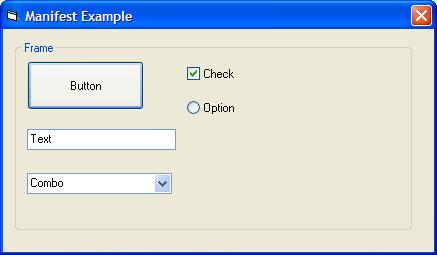



## How to embed a XP Style Manifest file into a VB Complied EXE?

### Description

This tutorial teaches how to embed a XP Style Manifest file into a VB Compiled EXE. So you don't have to give a .manifest file with your exe file after apply this... (VOTE PLEASE)
 
### More Info
 

             |
---                |---
**Submitted On**   |2002-12-12 23:06:44
**By**             |[Sukru Alatas](https://github.com/Planet-Source-Code/PSCIndex/blob/master/ByAuthor/sukru-alatas.md)
**Level**          |Beginner
**User Rating**    |5.0 (20 globes from 4 users)
**Compatibility**  |VB 6\.0
**Category**       |[Miscellaneous](https://github.com/Planet-Source-Code/PSCIndex/blob/master/ByCategory/miscellaneous__1-1.md)
**World**          |[Visual Basic](https://github.com/Planet-Source-Code/PSCIndex/blob/master/ByWorld/visual-basic.md)
**Archive File**   |[How\_to\_emb15120212122002\.zip](https://github.com/Planet-Source-Code/sukru-alatas-how-to-embed-a-xp-style-manifest-file-into-a-vb-complied-exe__1-41525/archive/master.zip)

### Source Code

 HOWTO: Embed a XP Style Manifest file into a VB
				Compiled EXE 
				Step by step explanation; 
				 
				<STRONG>1)</STRONG> Add line below to a module in project 
				Declare Sub InitCommonControls Lib
				"comctl32.dll" () 
				 
				<STRONG>2)</STRONG> Add lines below to all forms in project 
				Private Sub Form_Initialize() 
				Call InitCommonControls 
				End Sub
				 
				 
				<STRONG>3)</STRONG> Compile exe with normal way 
				 
				<STRONG>4)</STRONG> Download zip file that is given with this tutorial, and
				unzip it 
				 
				<STRONG>5)</STRONG> Download <EM>Resource Hacker™</EM> from <A href="http://www.users.on.net/johnson/resourcehacker/">
				here</A> 
			 
			<STRONG>6)</STRONG> Run program, then <EM>File>Open</EM>
				and select your compiled exe file 
				 
				<STRONG>7)</STRONG> Select <EM>Action>Add</EM> a new Resource 
				 
				<STRONG>8)</STRONG> Select <EM>'Open file with new resource'</EM> and open <EM>'GeneralManifestForVB.txt'</EM>
				file that was extract from zip file 
				 
				<STRONG>9)</STRONG> Enter info below to boxes 
				<EM>Resource type</EM> = 24 
				<EM>Resource name</EM> = 1 
				<EM>Resource language</EM> = 1033 (this code does not any effect on manifest) 
				 
				<STRONG>10)</STRONG> Click <EM>'Add Resource'</EM>
				 
				 
				<STRONG>11)</STRONG> Save EXE and run for testing 
				 
				<STRONG>12)</STRONG> Enjoy... 
				 
				  
				 
				additional informations; 
				-> Do not compress EXE with upx, 
				-> Place command button into a picture box if they has ugly frames after
				update EXE, 
				-> I do sorry for my bad english... 
			
		

